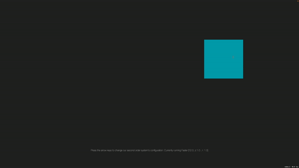

## Giving Personality to Procedural Animations using Math! 

Animation using Second-Order Systems: implemented with SpriteKit and Swift. 
Inspired by t3ssel8r's great [video on the subject](https://www.youtube.com/watch?v=KPoeNZZ6H4s) 

